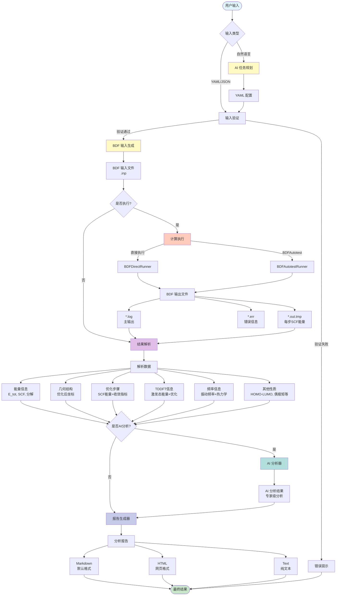
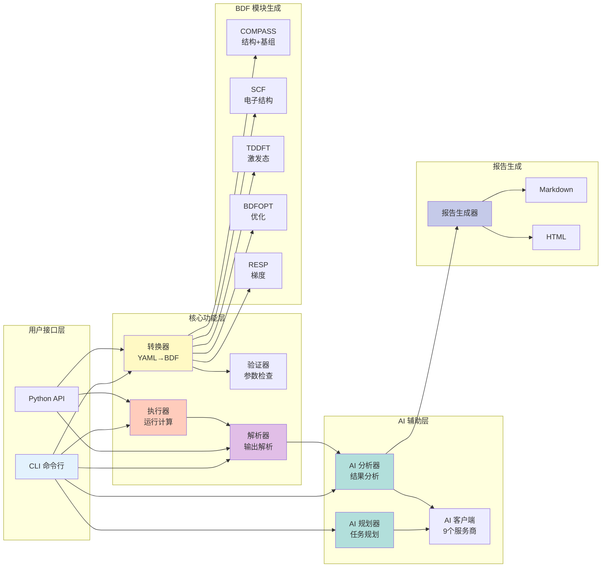
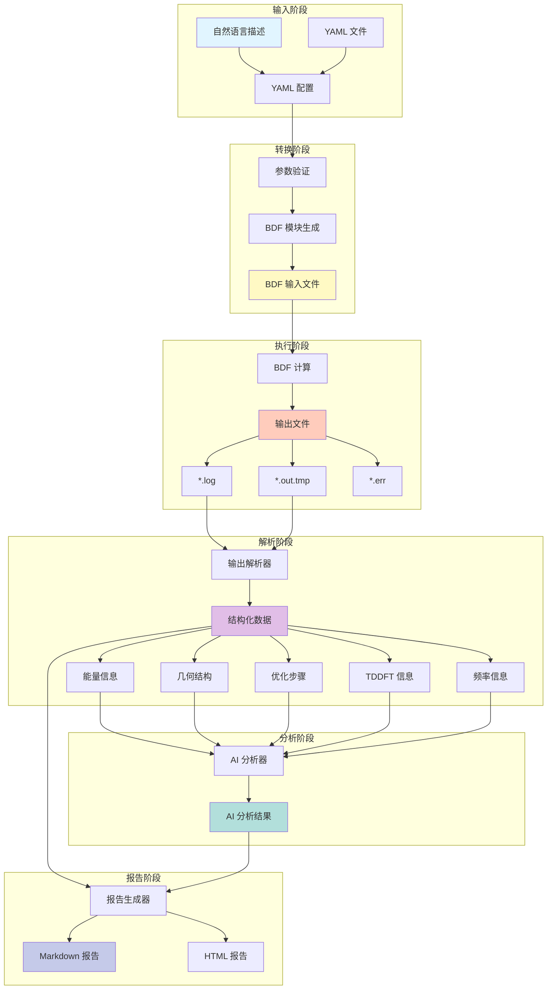

# BDFEasyInput 工作流程图

## 完整工作流程图



## 模块交互图



## 数据流图



## 优化步骤提取流程

```mermaid
graph TB
    Start([BDF 计算完成]) --> Log[读取 *.log 文件]
    Start --> Tmp[读取 *.out.tmp 文件]
    
    Log --> ExtractSteps[提取优化步骤]
    ExtractSteps --> StepInfo[步骤信息<br/>Force-RMS/Max<br/>Step-RMS/Max]
    
    Tmp --> ExtractSCF[提取 SCF 能量]
    ExtractSCF --> SCFEnergies[每步 SCF E_tot]
    
    Tmp --> ExtractTDDFT{是否TDDFT<br/>激发态优化?}
    ExtractTDDFT -->|是| ExtractGrad[提取 TDDFT 梯度]
    ExtractTDDFT -->|否| ExtractFinal
    
    ExtractGrad --> GradInfo[梯度信息<br/>ifile, irep, istate<br/>激发态 Etot]
    
    Tmp --> ExtractFinal[提取最终 SCF 结果]
    ExtractFinal --> FinalSCF[最终 SCF 能量分解<br/>E_tot, E_ele, E_nn<br/>E_1e, E_ne, E_kin<br/>E_ee, E_xc, Virial]
    
    StepInfo --> Combine[合并数据]
    SCFEnergies --> Combine
    GradInfo --> Combine
    FinalSCF --> Combine
    
    Combine --> BaseOpt{优化类型}
    BaseOpt -->|基态优化| BaseTable[基态优化步骤表<br/>Step | SCF Energy |<br/>Force-RMS | Force-Max |<br/>Step-RMS | Step-Max]
    BaseOpt -->|激发态优化| ExcTable[TDDFT 激发态优化表<br/>Step | SCF Energy | ifile |<br/>irep | istate | Excited Etot |<br/>Force-RMS | Force-Max |<br/>Step-RMS | Step-Max]
    
    BaseTable --> Report[报告生成]
    ExcTable --> Report
    FinalSCF --> Report
    
    Report --> End([分析报告])
    
    style Start fill:#e1f5ff
    style Combine fill:#fff9c4
    style BaseTable fill:#c8e6c9
    style ExcTable fill:#c8e6c9
    style Report fill:#c5cae9
    style End fill:#c8e6c9
```

## AI 模块工作流

```mermaid
graph TB
    Start([用户请求]) --> Type{请求类型}
    
    Type -->|任务规划| PlanFlow[规划流程]
    Type -->|结果分析| AnalyzeFlow[分析流程]
    
    subgraph PlanFlow[规划流程]
        PlanFlow --> P1[构建提示词]
        P1 --> P2[调用 AI 客户端]
        P2 --> P3[解析 AI 响应]
        P3 --> P4[生成 YAML 配置]
        P4 --> P5[方法推荐]
    end
    
    subgraph AnalyzeFlow[分析流程]
        AnalyzeFlow --> A1[解析输出文件]
        A1 --> A2[提取关键数据]
        A2 --> A3[构建分析提示词]
        A3 --> A4[调用 AI 客户端]
        A4 --> A5[解析 AI 分析]
        A5 --> A6[生成分析报告]
    end
    
    P2 --> AIClient[AI 客户端]
    A4 --> AIClient
    
    AIClient --> Provider{服务商}
    Provider -->|Ollama| Ollama[Ollama<br/>本地模型]
    Provider -->|OpenAI| OpenAI[OpenAI<br/>GPT-4/3.5]
    Provider -->|Anthropic| Anthropic[Anthropic<br/>Claude]
    Provider -->|OpenRouter| OpenRouter[OpenRouter<br/>统一接口]
    Provider -->|其他| Others[其他6个服务商]
    
    Ollama --> Response[AI 响应]
    OpenAI --> Response
    Anthropic --> Response
    OpenRouter --> Response
    Others --> Response
    
    Response --> P3
    Response --> A5
    
    P5 --> End1([YAML 配置])
    A6 --> End2([分析报告])
    
    style Start fill:#e1f5ff
    style AIClient fill:#b2dfdb
    style Response fill:#fff9c4
    style End1 fill:#c8e6c9
    style End2 fill:#c8e6c9
```

---

**说明**：这些流程图使用 Mermaid 语法，可以在支持 Mermaid 的 Markdown 查看器中直接渲染（如 GitHub、GitLab、VS Code 等）。
